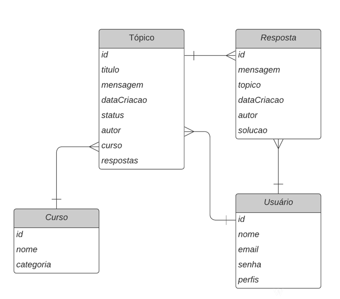

# Challenge Fórum Hub

Projeto realizado em Java + Spring Boot como challenge do curso Oracle One Next Education + Alura.

## Configurações para Execução do Projeto

### Pré-requisitos

- JDK 17 ou superior
- Maven 3.9.6 ou superior

### Configuração do Banco de Dados

- MySQL.
- Crie um banco de dados chamado `forumhub`.
- Preencha as credenciais de acesso ao seu banco de dados no arquivo *application.properties*
    - `spring.datasource.username=seuUsuario`
    - `spring.datasource.password=suaSenha`

# End Points

> [!NOTE]
> A autenticação não é necessária para criar usuário, fazer login, e ler tópicos e comentários. No entanto, todas as
> outras operações exigem autenticação via JWT.

- [User Endpoints](#user-endpoints)
    - [Create User](#create-user)
    - [Get User By ID](#get-user-by-id)
    - [Get Users](#get-users)
    - [Update User](#update-user)
    - [Delete User](#delete-user)
- [Login Endpoint](#login-endpoint)
    - [User Login](#user-login)
- [Topics Endpoints](#topics-endpoints)
    - [Create Topic](#create-topic)
    - [Get Topic By ID](#get-topic-by-id)
    - [Get All Topics](#get-topics)
    - [Get Topic By Course/Status](#get-topics-by-course-or-status)
    - [Update Topic](#update-topic)
    - [Delete Topic](#delete-topic)
- [Comments Endpoints](#comments-endpoints)
    - [Create Comment](#create-comment)
    - [Get Topic Comments](#get-topic-comments)
    - [Get Comment By ID](#get-comment-by-id)
    - [Delete Comment](#delete-comment)
- [Courses Endpoints](#courses-endpoints)
    - [Create Course](#create-course)
    - [Get Courses](#get-courses)
    - [Get Course By ID](#get-course-by-id)
    - [Update Course](#update-course)
    - [Delete Course](#delete-course)

## User Endpoints

### Create User

- **URL:** `/user`
- **Method:** `POST`
- **Description:** Cria novo usuário.
- **Request Body:**
  ```json
  {
    "name": "string",
    "email": "string",
    "password": "string"
  }
- **Response Body:**
  ```json
  {
    "id": "number",
    "name": "string",
    "role": "string",
    "is_active": "boolean"
  }

### Get User By ID

- **URL:** `/user`
- **Method:** `GET`
- **Description:** Obtém usuário pelo id.
- **Response Body:**
  ```json
  {
    "id": "number",
    "name": "string",
    "role": "string",
    "is_active": "boolean"
  }

### Get Users

- **URL:** `/user`
- **Method:** `GET`
- **Description:** Obtém lista de usuários.
- **Response Body:**
  ```json
  {
    "totalPages": "number",
    "totalElements": "number",
    "size": "number",
    "content": [
        {
            "id": "number",
            "name": "string",
            "role": "string",
            "is_active": "boolean"
        }
    ],
    "number": "number",
    "sort": {
        "empty": "boolean",
        "sorted": "boolean",
        "unsorted": "boolean"
    },
    "first": "boolean",
    "last": "boolean",
    "numberOfElements": "number",
    "pageable": {
        "pageNumber": "number",
        "pageSize": "number",
        "sort": {
            "empty": "boolean",
            "sorted": "boolean",
            "unsorted": "boolean"
        },
        "offset": "number",
        "paged": "boolean",
        "unpaged": "boolean"
    },
    "empty": "boolean"
  }

> [!NOTE]
> Neste endpoint é possível utilizar query params para a paginação, como, por exemplo: *?size=2&page=2*

### Update User

- **URL:** `/user/id`
- **Method:** `PUT`
- **Description:** Atualiza o usuário.
- **Request Body:**
  ```json
  {
    "name": "string",
    "email": "string",
    "password": "string"
  }
- **Response Body:**
  ```json
  {
    "id": "number",
    "name": "string",
    "role": "string",
    "is_active": "boolean"
  }

> [!NOTE]
> Os campos de atualização são opcionais.

### Delete User

- **URL:** `/user/id`
- **Method:** `DELETE`
- **Description:** Deleta o usuário.
- **Response Body:**

> [!NOTE]
> Não requer corpo de requisição; a resposta será `204 - No Content`.

## Login Endpoint

### User Login

- **URL:** `/login`
- **Method:** `POST`
- **Description:** Realiza o login.
- **Request Body:**
  ```json
  {
    "email": "string",
    "password": "string"
  }
- **Response Body:**
  ```json
  {
    "token": "string"
  }

## Topics Endpoints

### Create Topic

- **URL:** `/topic`
- **Method:** `POST`
- **Description:** Criação de tópico/postagem.
- **Request Body:**
  ```json
  {
    "title": "string",
    "text": "string",
    "course": "number"
  }
- **Response Body:**
    ```json
    {
      "id": "number",
      "title": "string",
      "text": "string",
      "status": "string",
      "author": "string",
      "course": "string",
      "created_at": "localdatetime"
    }

### Get Topic By ID

- **URL:** `/topic/id`
- **Method:** `GET`
- **Description:** Obtém o tópico pelo id.
- **Response Body:**
  ```json
  {
    "id": "number",
    "title": "string",
    "text": "string",
    "status": "string",
    "author": "string",
    "course": "string",
    "created_at": "localdatetime"
  }

### Get Topics

- **URL:** `/topic`
- **Method:** `GET`
- **Description:** Obtém uma lista de tópicos.
- **Response Body:**
  ```json
  {
    "totalPages": "number",
    "totalElements": "number",
    "size": "number",
    "content": [
        {
            "id": "number",
            "title": "string",
            "text": "string",
            "status": "string",
            "author": "string",
            "course": "string",
            "created_at": "localdatetime"
        }
    ],
    "number": "number",
    "sort": {
        "empty": "boolean",
        "sorted": "boolean",
        "unsorted": "boolean"
    },
    "first": "boolean",
    "last": "boolean",
    "numberOfElements": "number",
    "pageable": {
        "pageNumber": "number",
        "pageSize": "number",
        "sort": {
            "empty": "boolean",
            "sorted": "boolean",
            "unsorted": "boolean"
        },
        "offset": "number",
        "paged": "boolean",
        "unpaged": "boolean"
    },
    "empty": "boolean"
  }

> [!NOTE]
> Neste endpoint é possível utilizar query params para a paginação, como, por exemplo: *?size=2&page=2* e/ou buscar pelo
> título do tópico utilizando: *?title=umTituloAqui*

### Get Topics By Course Or Status

- **URL:** `/topic/filter?course=example&status=solucionado`
- **Method:** `GET`
- **Description:** Obtém uma lista de tópicos filtrados pelo curso ou status.
- **Response Body:**
  ```json
  {
    "totalPages": "number",
    "totalElements": "number",
    "size": "number",
    "content": [
        {
            "id": "number",
            "title": "string",
            "text": "string",
            "status": "string",
            "author": "string",
            "course": "string",
            "created_at": "localdatetime"
        }
    ],
    "number": "number",
    "sort": {
        "empty": "boolean",
        "sorted": "boolean",
        "unsorted": "boolean"
    },
    "first": "boolean",
    "last": "boolean",
    "numberOfElements": "number",
    "pageable": {
        "pageNumber": "number",
        "pageSize": "number",
        "sort": {
            "empty": "boolean",
            "sorted": "boolean",
            "unsorted": "boolean"
        },
        "offset": "number",
        "paged": "boolean",
        "unpaged": "boolean"
    },
    "empty": "boolean"
  }

> [!NOTE]
> Neste endpoint é imprescindível a query params *course* ou *status*

### Update Topic

- **URL:** `/topic/id`
- **Method:** `PUT`
- **Description:** Atualização do tópico.
- **Request Body:**
  ```json
  {
    "title": "string",
    "text": "string",
    "status": "string"
  }

> [!NOTE]
> Os campos de atualização são opcionais.

- **Response Body:**
    ```json
    {
      "id": "number",
      "title": "string",
      "text": "string",
      "status": "string",
      "author": "string",
      "course": "string",
      "created_at": "localdatetime"
    }

### Delete Topic

- **URL:** `/topic/id`
- **Method:** `DELETE`
- **Description:** Deleta o tópico.
- **Response Body:**

> [!NOTE]
> Não requer corpo de requisição; a resposta será `204 - No Content`.

## Comments Endpoints

### Create Comment

- **URL:** `/topic/id/comments`
- **Method:** `POST`
- **Description:** Criação de comentário.
- **Request Body:**
  ```json
  {
    "text": "string",
  }

- **Response Body:**
    ```json
    {
     "id": "number",
     "text": "string",
     "solution": "boolean",
     "topic_id": "number",
     "created_at": "localdatetime",
     "author_id": "number"
    }

### Get Topic Comments

- **URL:** `/topic/id/comments`
- **Method:** `GET`
- **Description:** Obtém os comentários do tópico.
- **Response Body:**
  ```json
  {
    "totalPages": "number",
    "totalElements": "number",
    "size": "number",
    "content": [
        {
            "id": "number",
            "text": "string",
            "solution": "boolean",
            "topic_id": "number",
            "created_at": "localdatetime",
            "author": "string"
        }
    ],
    "number": "number",
    "sort": {
        "empty": "boolean",
        "sorted": "boolean",
        "unsorted": "boolean"
    },
    "first": "boolean",
    "last": "boolean",
    "numberOfElements": "number",
    "pageable": {
        "pageNumber": "number",
        "pageSize": "number",
        "sort": {
            "empty": "boolean",
            "sorted": "boolean",
            "unsorted": "boolean"
        },
        "offset": "number",
        "paged": "boolean",
        "unpaged": "boolean"
    },
    "empty": "boolean"
  }

> [!NOTE]
> Neste endpoint é possível utilizar query params para a paginação, como, por exemplo: *?size=2&page=2*

### Get Comment By ID

- **URL:** `/comments/id`
- **Method:** `GET`
- **Description:** Obtém um comentário específico.
- **Response Body:**
  ```json
  {
   "id": "number",
   "text": "string",
   "solution": "boolean",
   "topic_id": "number",
   "created_at": "localdatetime",
   "author": "string"
  }

### Mark Comment As Solution

- **URL:** `/topic/topic_id/comments/comment_id`
- **Method:** `PATCH`
- **Description:** Marca um comentário como solução.
- **Response Body:**
  ```json
  {
    "id": "number",
    "text": "string",
    "solution": "boolean",
    "topic_id": "number",
    "created_at": "localdatetime",
    "author_id": "number"
  }

> [!NOTE]
> Somente o dono do tópico tem a permissão de marcar um comentário como solução e desde que esse comentário pertença ao
> seu tópico e, além disso, após haver um comentário como solução o tópico ficará fechado para novos comentários.

### Delete Comment

- **URL:** `/comments/id`
- **Method:** `GET`
- **Description:** Deleta um comentário específico.
- **Response Body:**

> [!NOTE]
> Não requer corpo de requisição; a resposta será `204 - No Content`.

## Courses Endpoints

### Create Course

- **URL:** `/course`
- **Method:** `POST`
- **Description:** Criação de curso.
- **Request Body:**
  ```json
  {
    "name": "string",
    "category": "string"
  }

> [!NOTE]
> **Categorias disponíveis**: Backend, Frontend, Mobile, DevOps, UI/UX Design, Data Science, Gestão e Inovação,
> Inteligência Artificial, Programação, Desenvolvimento Web, Desenvolvimento Mobile, Segurança da Informação, Cloud
> Computing, Design, Blockchain, Desenvolvimento de Jogos, Marketing, IoT, e Gestão de Projetos.

- **Response Body:**
    ```json
    {
      "id": "number",
      "name": "string",
      "category": "string"
    }

> [!NOTE]
> Somente administradores tem a permissão de criar cursos.

### Get Courses

- **URL:** `/course`
- **Method:** `GET`
- **Description:** Obtém os cursos.
- **Response Body:**
    ```json
    {
    "totalPages": "number",
    "totalElements": "number",
    "size": "number",
    "content": [
        {
            "id": "number",
            "name": "string",
            "category": "string"
        }
    ],
    "number": "number",
    "sort": {
        "empty": "boolean",
        "sorted": "boolean",
        "unsorted": "boolean"
    },
    "first": "boolean",
    "last": "boolean",
    "numberOfElements": "number",
    "pageable": {
        "pageNumber": "number",
        "pageSize": "number",
        "sort": {
            "empty": "boolean",
            "sorted": "boolean",
            "unsorted": "boolean"
        },
        "offset": "number",
        "paged": "boolean",
        "unpaged": "boolean"
    },
    "empty": "boolean"
    }

### Get Course By ID

- **URL:** `/course/id`
- **Method:** `GET`
- **Description:** Obtém um curso específico.
- **Response Body:**
    ```json
    {
      "id": "number",
      "name": "string",
      "category": "string"
    }

### Update Course

- **URL:** `/course/id`
- **Method:** `PUT`
- **Description:** Atualização de curso.
- **Request Body:**
  ```json
  {
    "name": "string",
    "category": "string"
  }

> [!NOTE]
> Campos opcionais
>
> **Categorias disponíveis**: Backend, Frontend, Mobile, DevOps, UI/UX Design, Data Science, Gestão e Inovação,
> Inteligência Artificial, Programação, Desenvolvimento Web, Desenvolvimento Mobile, Segurança da Informação, Cloud
> Computing, Design, Blockchain, Desenvolvimento de Jogos, Marketing, IoT, e Gestão de Projetos.

- **Response Body:**
    ```json
    {
      "id": "number",
      "name": "string",
      "category": "string"
    }

> [!NOTE]
> Somente administradores tem a permissão de atualizar cursos.

### Delete Course

- **URL:** `/course/id`
- **Method:** `DELETE`
- **Description:** Deleta um curso específico.
- **Response Body:**

> [!NOTE]
> Não requer corpo de requisição; a resposta será `204 - No Content`.
> Somente administradores tem a permissão de excluir cursos.

# Diagrama Proposto para o Banco de Dados



### Reference Documentation

For further reference, please consider the following sections:

* [Official Apache Maven documentation](https://maven.apache.org/guides/index.html)
* [Spring Boot Maven Plugin Reference Guide](https://docs.spring.io/spring-boot/docs/3.3.1/maven-plugin/reference/html/)
* [Create an OCI image](https://docs.spring.io/spring-boot/docs/3.3.1/maven-plugin/reference/html/#build-image)
* [Spring Boot DevTools](https://docs.spring.io/spring-boot/docs/3.3.1/reference/htmlsingle/index.html#using.devtools)
* [Spring Web](https://docs.spring.io/spring-boot/docs/3.3.1/reference/htmlsingle/index.html#web)
* [Spring Data JPA](https://docs.spring.io/spring-boot/docs/3.3.1/reference/htmlsingle/index.html#data.sql.jpa-and-spring-data)
* [Validation](https://docs.spring.io/spring-boot/docs/3.3.1/reference/htmlsingle/index.html#io.validation)
* [Spring Security](https://docs.spring.io/spring-boot/docs/3.3.1/reference/htmlsingle/index.html#web.security)

### Guides

The following guides illustrate how to use some features concretely:

* [Building a RESTful Web Service](https://spring.io/guides/gs/rest-service/)
* [Serving Web Content with Spring MVC](https://spring.io/guides/gs/serving-web-content/)
* [Building REST services with Spring](https://spring.io/guides/tutorials/rest/)
* [Accessing Data with JPA](https://spring.io/guides/gs/accessing-data-jpa/)
* [Accessing data with MySQL](https://spring.io/guides/gs/accessing-data-mysql/)
* [Validation](https://spring.io/guides/gs/validating-form-input/)
* [Securing a Web Application](https://spring.io/guides/gs/securing-web/)
* [Spring Boot and OAuth2](https://spring.io/guides/tutorials/spring-boot-oauth2/)
* [Authenticating a User with LDAP](https://spring.io/guides/gs/authenticating-ldap/)

### Maven Parent overrides

Due to Maven's design, elements are inherited from the parent POM to the project POM.
While most of the inheritance is fine, it also inherits unwanted elements like `<license>` and `<developers>` from the
parent.
To prevent this, the project POM contains empty overrides for these elements.
If you manually switch to a different parent and actually want the inheritance, you need to remove those overrides.

